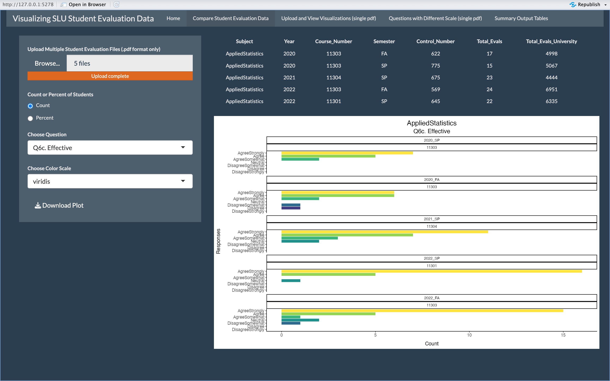
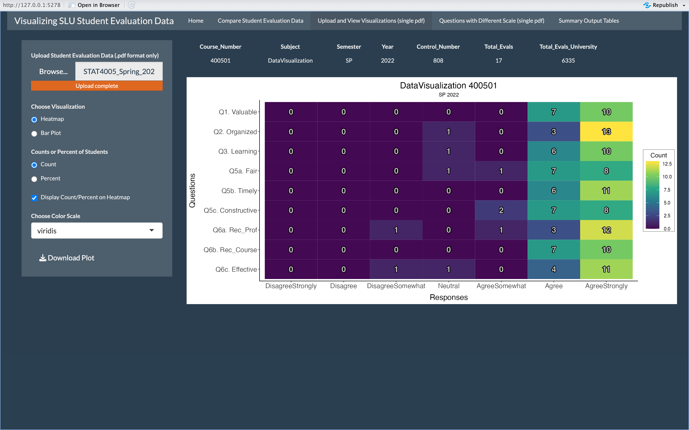
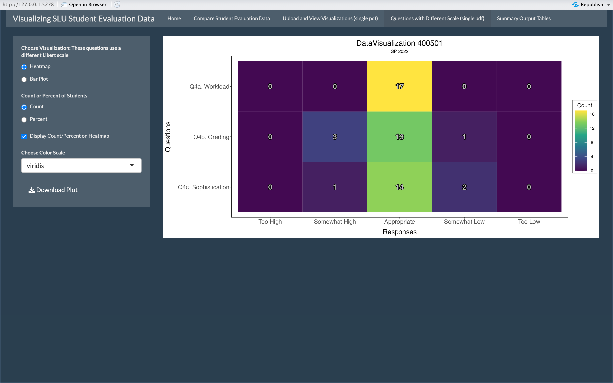
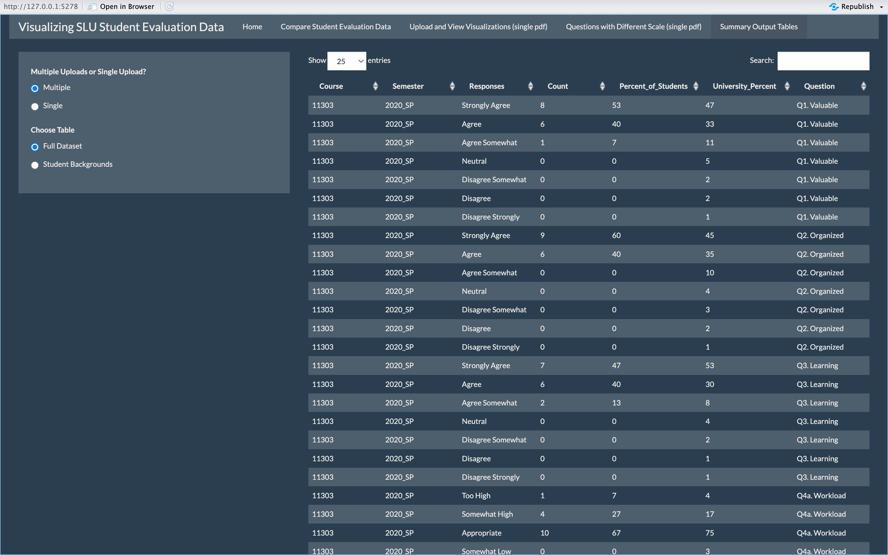
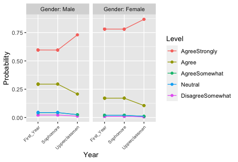

```{r setup, include=FALSE}
knitr::opts_chunk$set(echo = FALSE, message = FALSE)
```

# Goal and Description

-   Create Shiny App to scrape student evaluation data from PDFs and provide a more in-depth analysis of the data by providing appropriate visuals

-   Model and predict ordinal responses based on student class year and sex

**Process**

1.  Scrape data from summary reports

2.  Wrangle data and construct visualizations

3.  Write functions for data scraping and wrangling

4.  Build and test Shiny App

5.  Fit ordinal logistic regression model and visualize

# Likert Scale Data

-   SLU student evaluations use a 7-point Likert scale, which refers to the set of potential responses to different statements ranging from *Strongly Disagree* to *Strongly Agree*

-   Likert scale data is best analyzed and interpreted through visualizations, such as Heatmaps or Bar Plots, rather than mean score of responses

```{r, out.width = "1300px", fig.align = "center"}
library(tidyverse)
year_label <- as_labeller(c
                ('1' = "Year 1",
                '2' = "Year 2"))
toy_df <- tibble(year = c(rep(1, 5), rep(2, 5)),
                 resp = rep(c("Agree", "Agree somewhat", "Neutral",
                              "Disagree somewhat", "Disagree"), 2),
                 n_resp = c(5, 2, 1, 2, 5, 
                            0, 2, 11, 2, 0)) |>
  mutate(resp = fct_inorder(resp))
ggplot(data = toy_df, aes(x = resp, y = n_resp)) +
  geom_col(colour = "black", fill = "lightblue") +
  facet_wrap(~year,
             labeller = year_label) +
  coord_flip() +
  labs(x = "Response", y = "Number of Students",
       title = "Example Distribution using Likert Scale Data") +
  theme(plot.title = element_text(hjust = 0.5))
```

-   The mean of both data sets is the same (3 points, or Neutral) but the distributions are very different

-   Using the average from these two data sets fails to communicate what was actually reported by participants, illustrating the danger of using the averages of Likert Scale data

# Shiny App Tabs

```{r, out.width = "1050px", fig.align = "center"}




# <div align = "center">*Also features a home tab with project description and GitHub link*
```

# Modeling with Ordinal Logistic Regression

-   Fitted ordinal logistic regression model to predict and visualize probability of student responses based on student class year and sex

```{r, echo = FALSE, message = FALSE, warning = FALSE, results = 'hide'}
library(knitr)
library(pander)
library(tidyverse)
library(dplyr)
library(pdftools)
library(MASS)
library(reshape2)
library(kableExtra)
source("model_function1.R")
source("model_function2.R")
# load data 
level_113 <- model_function("/Users/lilykasperek/Desktop/Fellowship2023/eval_pdfs/STAT113_Spring_2020_2.pdf")
level_213 <- model_function("/Users/lilykasperek/Desktop/Fellowship2023/eval_pdfs/STAT213_Spring_2020_1.pdf")
level_234 <- model_function("/Users/lilykasperek/Desktop/Fellowship2023/eval_pdfs/STAT234_Fall_2020_1.pdf")
all_levels <- bind_rows(level_113, level_213, level_234) 
all_levels <- all_levels |> dplyr::filter(full_question == "Q6c. Effective")
# separate course column 
all_levels <- all_levels |> 
  separate(col = course, into = c("Course_Level", "Section"),
                       sep = "0") 
# delete section column
all_levels <- all_levels |> 
  dplyr::select(-Section) 
# filter out different likert scale 
#all_levels <- all_levels |> 
  #dplyr::filter(responses != "Too High" &
                                #responses != "Too Low" &
                                #responses != "Appropriate" &
                                #responses != "Somewhat High" &
                                #responses != "Somewhat Low" &
                                  #full_question == "Q6c. Effective")
# select columns needed for model 
all_levels <- all_levels |> 
  dplyr::select(full_question, Course_Level, responses_hm, everything())
# fct_collapse() to prevent errors 
all_levels <- all_levels |> 
  dplyr::mutate(new_responses = fct_collapse(responses_hm,
                                                  Agree = c("AgreeStrongly",
                                                            "Agree"),
                                                  Neutral = c("AgreeSomewhat",
                                                              "Neutral",
                                                              "DisagreeSomewhat"),
                                                  Disagree = c("Disagree",
                                                               "DisagreeStrongly"))) 
# check new_responses
all_levels <- all_levels |>
  dplyr::select(new_responses, everything()) 
# use uncount() for response to show up correct amount of times 
model <- all_levels |> 
  uncount(count_hm)
summary(model)
# fit model
model_fit <- polr(new_responses ~ Course_Level, data = model, Hess = TRUE)
model_fit2 <- polr(responses_hm ~ Course_Level, data = model, Hess = TRUE)
# summary of fit model collapsed responses
summary(model_fit)
(ctable <- coef(summary(model_fit)))
p <- pnorm(abs(ctable[, "t value"]), lower.tail = FALSE) * 2
(ctable <- cbind(ctable, "p value" = p))
exp(coef(model_fit))
# summary of fit model old responses
summary(model_fit2)
(ctable2 <- coef(summary(model_fit2)))
p <- pnorm(abs(ctable2[, "t value"]), lower.tail = FALSE) * 2
(ctable <- cbind(ctable2, "p value" = p))
exp(coef(model_fit2))
lev_113 <- model_function2("/Users/lilykasperek/Desktop/Fellowship2023/eval_pdfs/STAT113_Spring_2020_2.pdf")
lev_213 <- model_function2("/Users/lilykasperek/Desktop/Fellowship2023/eval_pdfs/STAT213_Spring_2020_1.pdf")
lev_234 <- model_function2("/Users/lilykasperek/Desktop/Fellowship2023/eval_pdfs/STAT234_Fall_2020_1.pdf")
all_levs <- bind_rows(lev_113, lev_213, lev_234) 
all_levs <- all_levs |>
  separate(col = course, into = c("Course_Level", "Section"),
                       sep = "0") 
all_levs <- all_levs |>
  dplyr::select(-Section)
all_levs <- all_levs |>
  dplyr::select(full_question, Course_Level, responses, everything())
all_levs <- all_levs |> mutate(responses = as.factor(responses))
levels(all_levs$responses)
all_levs <- all_levs |> mutate(new_responses = factor(responses,
                                          levels = c("Too Low",
                                                     "Somewhat Low",
                                                     "Appropriate",
                                                     "Somewhat High",
                                                     "Too High")))
levels(all_levs$new_responses)
all_levs <- all_levs |>
  mutate(count = as.double(n_students))
all_levs <- all_levs |>
  uncount(count)
model_2 <- all_levs |>
  filter(full_question == "Q4c. Sophistication")
summary(model_2)
mod_fit <- polr(new_responses ~ Course_Level, data = model_2, Hess = TRUE)
mod_fit2 <- polr(responses ~ Course_Level, data = model_2, Hess = TRUE)
# summary of fit model new responses
summary(mod_fit)
(ctable_mod <- coef(summary(mod_fit)))
p <- pnorm(abs(ctable_mod[, "t value"]), lower.tail = FALSE) * 2
(ctable <- cbind(ctable_mod, "p value" = p))
exp(coef(mod_fit))
# summary of fit model old responses
summary(mod_fit2)
(ctable_mod2 <- coef(summary(mod_fit2)))
p <- pnorm(abs(ctable_mod2[, "t value"]), lower.tail = FALSE) * 2
(ctable <- cbind(ctable_mod2, "p value" = p))
exp(coef(mod_fit2))
library(readr)
modeling_data <- read_csv("~/Desktop/Fellowship2023/Fellowship_Poster/modeling_data_student_by_student.csv")
modeling_data

modeling_data <- modeling_data |> mutate(Reason = as.character(Reason),
                        Year = as.character(Year),
                        Gender = as.character(Gender),
                        Response = as.character(Response))
model_df <- modeling_data |> 
  mutate(reason = fct_recode(Reason,
                             Major = "1",
                             Minor = "2",
                             Distribution = "3",
                             Interest = "4",
                             Instructor = "5",
                             Other = "6")) |>
  mutate(year = fct_recode(Year,
                           First_Year = "1",
                           Sophomore = "2",
                           Junior = "3",
                           Senior = "4")) |>
  mutate(gender = fct_recode(Gender,
                             Male = "1",
                             Female = "2",
                             Other = "3",
                             PNTD = "4")) |>
  mutate(response = fct_recode(Response,
                               DisagreeStrongly = "1",
                               Disagree = "2",
                               DisagreeSomewhat = "3",
                               Neutral = "4",
                               AgreeSomewhat = "5",
                               Agree = "6",
                               AgreeStrongly = "7")) 
model_df <- model_df |>
  dplyr::mutate(new_responses = fct_collapse(response,
                                                  Agree = c("AgreeStrongly",
                                                            "Agree"),
                                                  Neutral = c("AgreeSomewhat",
                                                              "Neutral",
                                                              "DisagreeSomewhat"),
                                                  Disagree = c("Disagree",
                                                               "DisagreeStrongly")))

mod_df <- model_df |> 
  dplyr::select(Reason, reason, Year, year, Gender, gender, Response, response, new_responses,
                   Course, Semester)
# models 
summary(mod_df)
mod_df$new_responses
# error: year_mod <- polr(response ~ year, data = mod_df, Hess = TRUE)
year_mod <- polr(response ~ year, data = mod_df, Hess = TRUE)
summary(year_mod)
# error: gender_mod <- polr(new_responses ~ gender, data = mod_df, Hess = TRUE)
gender_mod <- polr(response ~ gender, data = mod_df, Hess = TRUE)
summary(gender_mod)
# error: both_mod <- polr(new_responses ~ year + gender, data = mod_df, Hess = TRUE)
both_mod <- polr(response ~ year + gender, data = mod_df, Hess = TRUE)
summary(both_mod)
mod_df_filter <-
  mod_df |> filter(is.na(year) != TRUE) |>
  filter(is.na(gender) != TRUE) |>
  filter(is.na(reason) != TRUE)
summary(mod_df_filter)
year_mod_2 <- polr(response ~ year, data = mod_df_filter, Hess = TRUE)
summary(year_mod_2)
gender_mod_2 <- polr(response ~ gender, data = mod_df_filter, Hess = TRUE)
summary(gender_mod_2)
both_mod_2 <- polr(response ~ year + gender, data = mod_df_filter, Hess = TRUE)
summary(both_mod_2)
(ctable <- coef(summary(both_mod_2)))
p <- pnorm(abs(ctable[, "t value"]), lower.tail = FALSE) * 2
(ctable <- cbind(ctable, "p value" = p))
#(ci <- confint(both_mod_2))
exp(coef(both_mod_2))
newdat <- cbind(mod_df_filter, predict(both_mod_2, type = "probs")) |>
  dplyr::select(-reason, -year, -Response, -Semester, -Course,
                -response, -new_responses, -Gender)
new_dat <- newdat |> dplyr::rename(Gender = 'gender')
lnewdat <- melt(new_dat, id.vars = c("Reason", "Year", "Gender"),
                variable.name = "Level", value.name = "Probability")
lnewdat <- lnewdat |> 
  mutate(Level = fct_relevel(Level, c("AgreeStrongly",
                                      "Agree",
                                      "AgreeSomewhat",
                                      "Neutral",
                                      "DisagreeSomewhat")))
head(lnewdat)
table_lnewdat <- lnewdat |>
  slice(1, 67, 131, 195, 197) |>
  mutate(Reason = fct_recode(Reason,
                             Major = "1",
                             Distribution = "3",
                             Interest = "4")) |>
  dplyr::select(Reason, Year, everything())
```

```{r}
kable_lnewdat <- kable(table_lnewdat) |>
  kable_styling(full_width = FALSE,
                font_size = 24)
kable_lnewdat 
```

```{r, out.width = "910px", fig.align = "center"}

```

# Additional Visualization

-   Static visualization of new question added to student evaluations

# References

Barry, D. (2017). *bookdown: Do not use averages with Likert scale data.* <https://bookdown.org/Rmadillo/likert/>.

Joshi, A., Kale, S., Chandel, S., & Pal, D. K. (2015). Likert Scale: Explored and Explained. *British Journal of Applied Science and Technology, 7*(4), 396-403.
